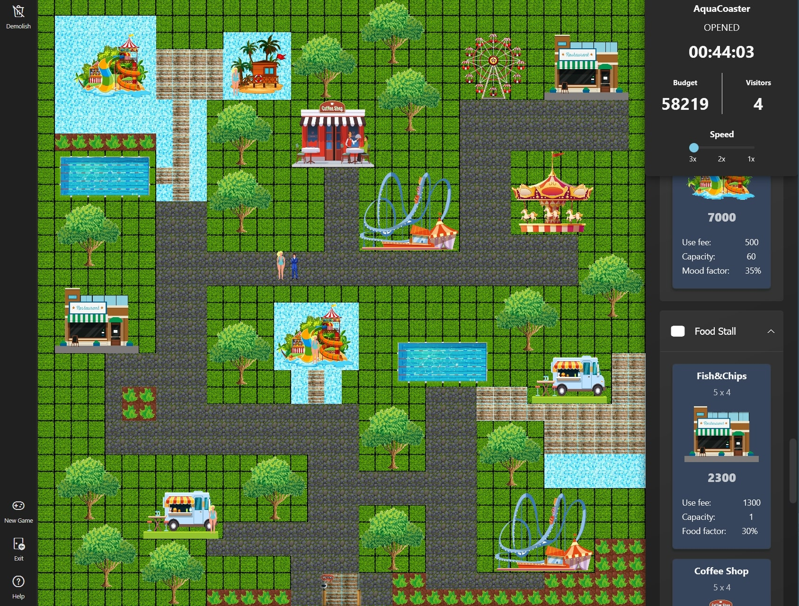
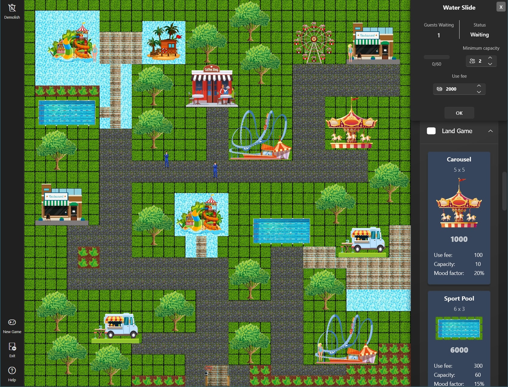
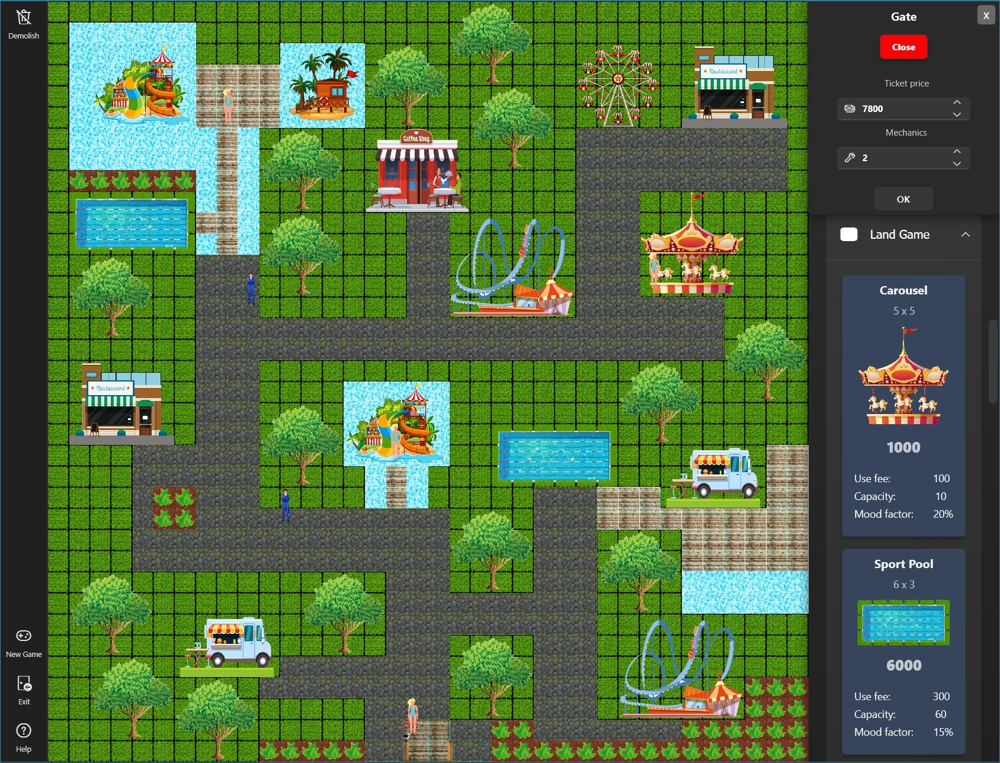
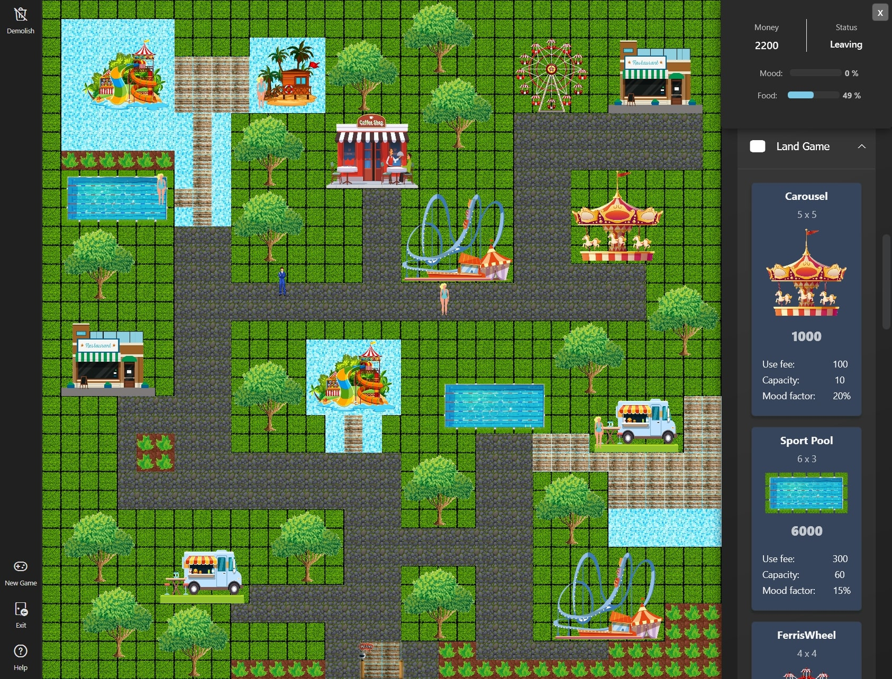
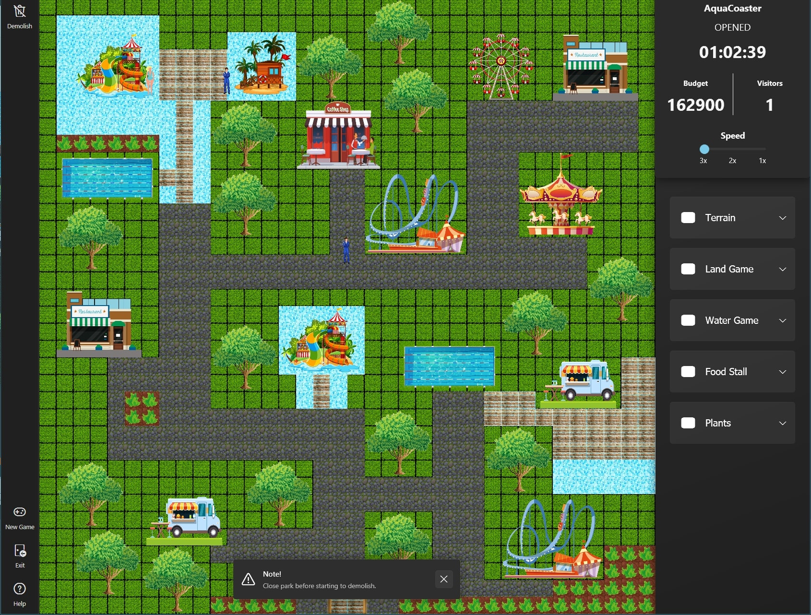
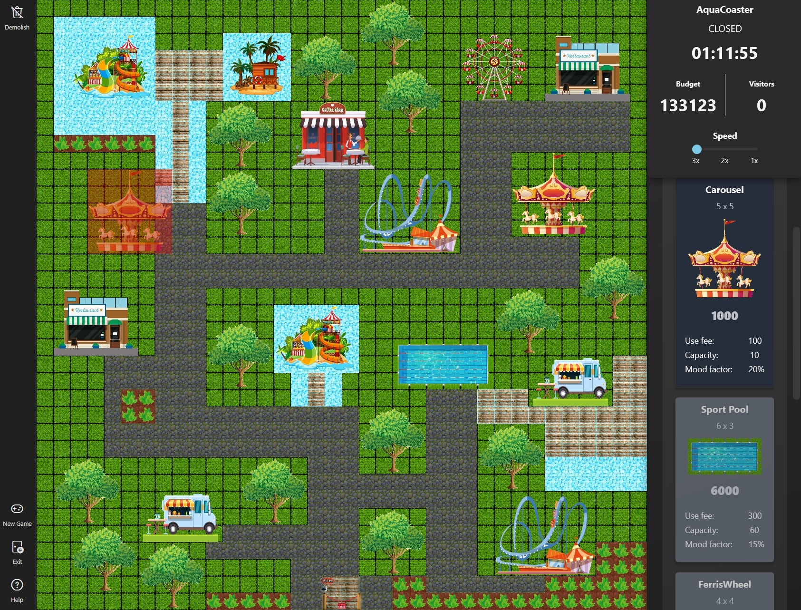
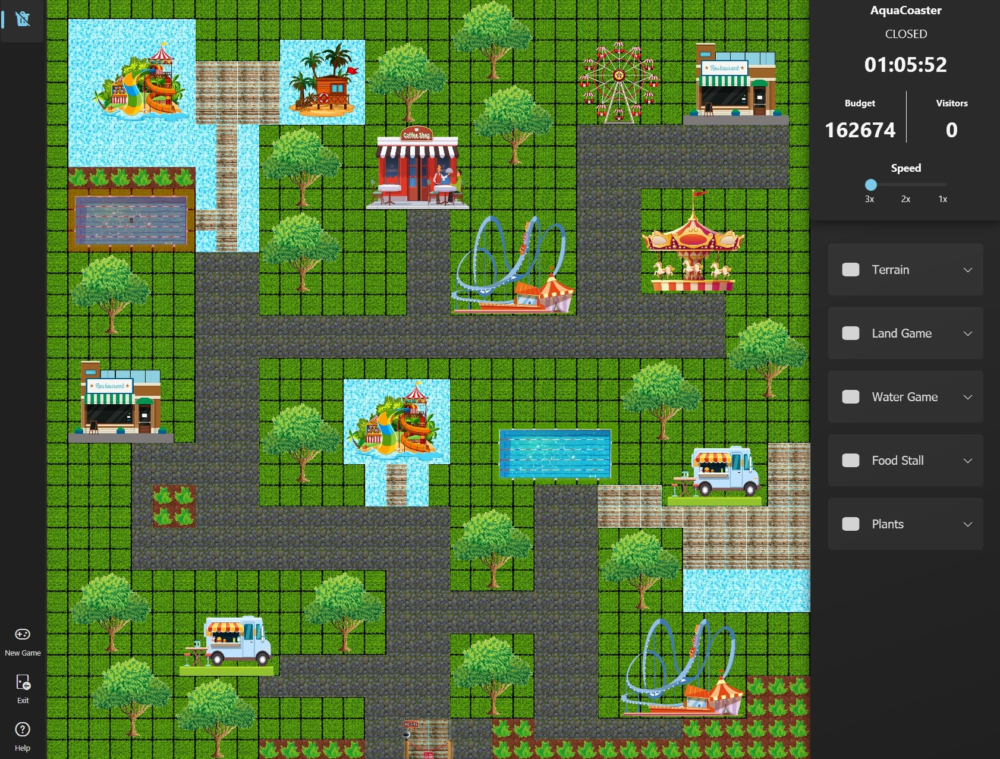

# AquaCoaster

## About
Course project for [Software Technology](https://mcserep.web.elte.hu/elte/szt).

A tycoon game written in C# using Windows Presentation Foundation (WPF) framework. 

**This is the work of a 5-member team.**

## Screenshots

